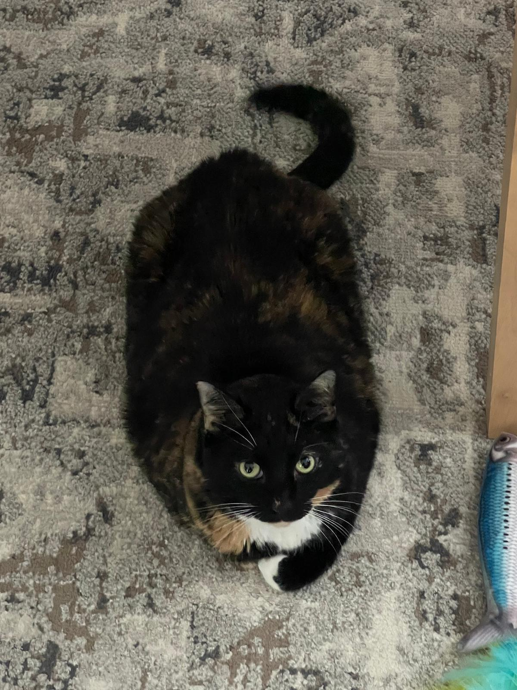

I always could write decent enough to get through academia, but those were all very technical or 
without real intention. In other words, I will blog to get my weird ideas out, to share them with
others without worrying about arbitrary styles guidelines or requirements, and to just have fun. 
 
 

The content will be anything from random thoughts, technical programming tutorials (mainly for
myself), and everything in between. Additionally, I don't have a set schedule for releasing 
blogging content because life gets in the way. Did I mention I have a cat (and another one 
coming soon)?

Thanks for reading my first blog, and have a good day/night.
