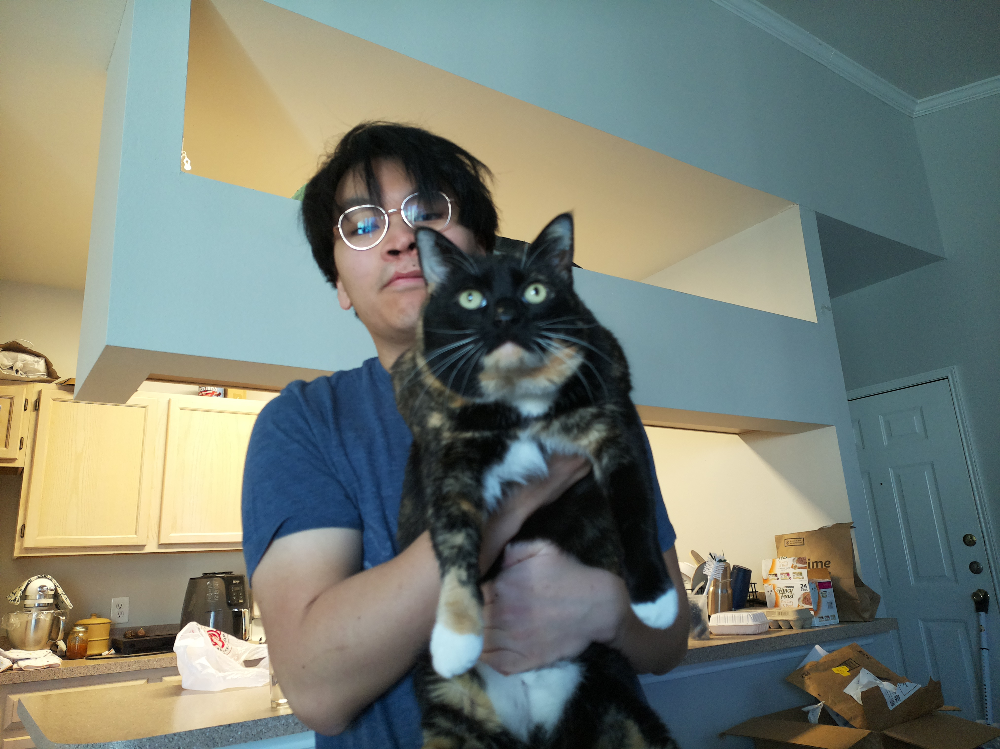
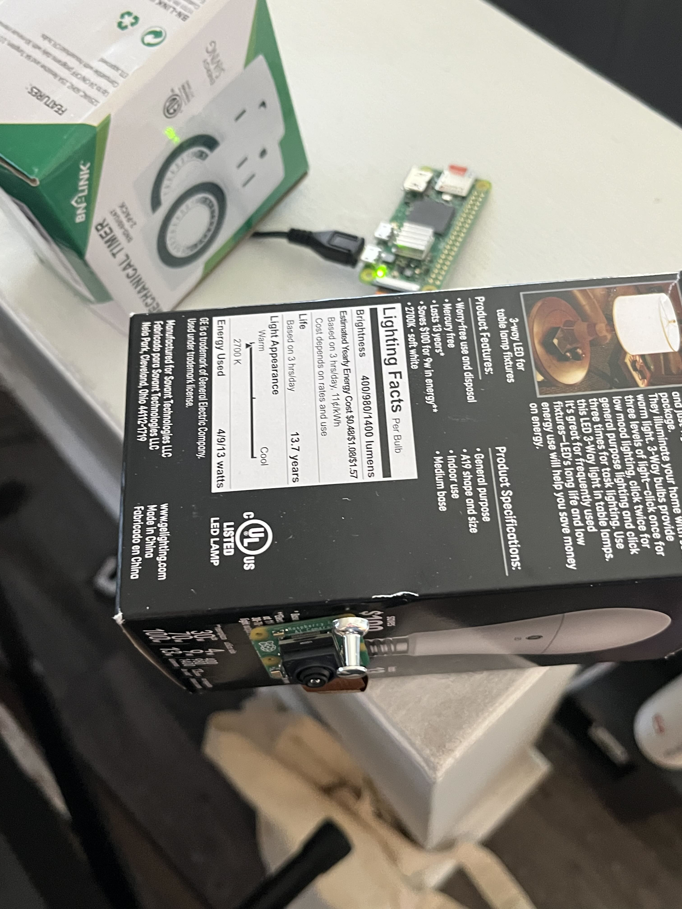

I have been dabbling in raspberry pi's lately and they are really quite fascinating. Such a small form factor but can do traditional computing tasks and computing on the edge. I was gifted a Raspberry Pi 4 a few years ago and only recently used it for something other than collecting dust. Now, its a valiant network-wide ad-blocker with its very own dashboard (shoutout to the folks at Adguard)! I wanted to do something a bit more low-level like with real wires and moving parts.

 
    
Recently, my partner has been complaining that our indoor camera has been lacking in quality/motion detection capabilities, not to mention, it requires a $100 subscription to store the recordings! A switch flicked in my head and I thought, "Why don't I try to make an indoor camera because I already have a NAS (network attached storage) to store my own recordings, and I could just program a bash script to clean the storage every few months or so..." From there, it was a simple as making a grocery list of things I needed:

 

- indenpendent PCB for the brains of the camera
- an actual camera 
- protective case so its not all out in the open

I chose the Raspberry Pi 02w because of its small form factor and this impressive compute for my PCB and the Raspberry Pi Ai Camera because of its bulilt-in models for object recognition. Below is a snapshot from the real headless setup.

 

 

In terms of cost, the 02w was about $50 for all necessary parts which includes shipping and I picked up the camera for $80 at my local tech shop, so not very cheap. Maybe I went a bit overboard, but I really wanted this to be something that could replace the home security system.

 
There weren't any custom cases I really liked online, so I'm planning to design and 3d print my own. If you're curious, this is what it looks like bare bones in all its glory.

 

Stay tuned for part 2!

